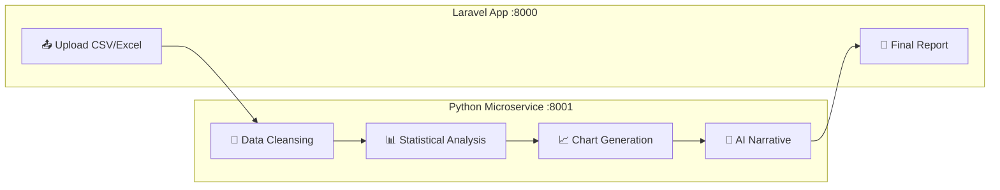

<p align="center">
  <h1 align="center">📊 DataNarasi</h1>
  <p align="center">
    <strong>AI-Powered Data Analysis & Narrative Generation Platform</strong>
  </p>
  <p align="center">
    Upload CSV/Excel → Auto Clean → Statistical Analysis → AI-Generated Business Insights in Bahasa Indonesia
  </p>
  <p align="center">
    <a href="#features"></a>
    <a href="#tech-stack"></a>
    <a href="#tech-stack"></a>
    <a href="#tech-stack"></a>
    <a href="#tech-stack"></a>
  </p>
</p>

---

## 🎯 What is DataNarasi?

**DataNarasi** is a full-stack web application that transforms raw data into actionable business insights — automatically. Upload your CSV or Excel file, and the platform will:

1. 🧹 **Clean your data** — Handle missing values, duplicates, encoding issues
2. 📈 **Analyze statistically** — Descriptive stats, trend detection, growth rates
3. 📊 **Generate charts** — Automated visualizations with Matplotlib/Seaborn
4. 🤖 **Write narratives** — AI-generated business insights in **Bahasa Indonesia**

Built for **Indonesian SMBs and data analysts** who need professional data reports without writing a single line of code.

---

## ✨ Features

### 🤖 Multi-AI Provider System (6 Providers!)

DataNarasi features an intelligent **fallback chain** that automatically switches between AI providers if one fails:

```
Gemini → Kimi → GLM → NVIDIA NIM → MiniMax → Claude
```

| # | Provider | Model | Status |
|---|----------|-------|--------|
| 1 | **Google Gemini** | `gemini-3-flash-preview` | ✅ Free |
| 2 | **Kimi (Moonshot)** | `moonshot-v1-8k` | ✅ Free |
| 3 | **GLM (Zhipu AI)** | `GLM-4.5-air` | ✅ Free |
| 4 | **NVIDIA NIM** | `meta/llama-3.1-8b-instruct` | ✅ Free (40 RPM) |
| 5 | **MiniMax** | `MiniMax-M2.5` | ✅ Free |
| 6 | **Claude (Anthropic)** | `claude-sonnet-4` | 💰 Paid |

> **Zero downtime AI**: If Gemini is rate-limited, it automatically tries Kimi, then GLM, then NVIDIA, then MiniMax. Customize the order in `.env` without touching code!

### 📋 Core Features

- 📤 **Drag & Drop Upload** — CSV and Excel files up to 10MB
- 🧹 **Smart Data Cleansing** — Encoding detection, deduplication, type conversion
- 📊 **Statistical Analysis** — Descriptive stats, trend analysis, top products
- 📈 **Auto Chart Generation** — Bar, line, and pie charts via Matplotlib
- ✍️ **AI Narrative Generation** — Business insights written in natural Bahasa Indonesia
- 📜 **Report History** — View all past analyses with full details
- ⚙️ **Admin Panel** — Manage AI providers, toggle enable/disable
- 🔄 **Background Processing** — Non-blocking async processing via FastAPI BackgroundTasks

---

## 🏗️ Tech Stack

### Backend
| Technology | Purpose |
|------------|---------|
| **Laravel 13** | PHP backend, API, authentication (Breeze) |
| **Inertia.js** | SPA bridge between Laravel & Vue |
| **MySQL** | Primary database |
| **Queue (Database)** | Background job processing |

### Frontend
| Technology | Purpose |
|------------|---------|
| **Vue 3** | Reactive UI with Composition API |
| **Tailwind CSS** | Utility-first styling |
| **Pinia** | State management |
| **Vite** | Build tool with HMR |

### Python Microservice
| Technology | Purpose |
|------------|---------|
| **FastAPI** | High-performance async API |
| **Pandas** | Data cleaning & analysis |
| **Matplotlib / Seaborn** | Chart generation |
| **OpenAI SDK** | Unified AI provider interface |

---

## 📁 Project Structure

```
data-narasi/
├── app/
│   ├── Enums/              # ReportStatus, AnalysisType
│   ├── Http/Controllers/   # Upload, Report, Admin, API Callback
│   ├── Jobs/               # ProcessDataJob
│   ├── Models/             # User, Report, AIProvider, AIUsageLog
│   └── Services/           # PythonServiceClient
├── python-service/
│   ├── main.py             # FastAPI entrypoint
│   ├── cleaner.py          # Pandas data cleansing pipeline
│   ├── analyzer.py         # Statistical analysis engine
│   ├── chart_generator.py  # Matplotlib chart output
│   ├── prompt_builder.py   # AI prompt engineering
│   ├── ai_provider.py      # Multi-AI fallback manager
│   └── providers/
│       ├── base.py          # Abstract base provider
│       ├── gemini.py        # Google Gemini
│       ├── kimi.py          # Moonshot Kimi
│       ├── glm.py           # Zhipu GLM
│       ├── nvidia.py        # NVIDIA NIM API
│       ├── minimax.py       # MiniMax API
│       └── claude.py        # Anthropic Claude
├── resources/js/
│   ├── Components/          # Vue components
│   └── Pages/               # Vue pages (Inertia)
└── docs/                    # Architecture & API docs
```

---

## 🚀 Getting Started

### Prerequisites

- PHP 8.3+
- Composer
- Node.js 18+
- Python 3.11+
- MySQL

### Installation

```bash
# 1. Clone the repository
git clone https://github.com/Gimm17/data-narasi.git
cd data-narasi

# 2. Install PHP dependencies
composer install

# 3. Setup environment
cp .env.example .env
php artisan key:generate

# 4. Configure database in .env, then migrate & seed
php artisan migrate --seed

# 5. Install Node dependencies
npm install

# 6. Install Python dependencies
cd python-service
pip install -r requirements.txt
cd ..
```

### Configuration

Add your AI API keys to `.env`:

```env
# Get free keys from:
GEMINI_API_KEY=        # https://aistudio.google.com/apikey
KIMI_API_KEY=          # https://platform.moonshot.cn/
GLM_API_KEY=           # https://open.bigmodel.cn/
NVIDIA_API_KEY=        # https://build.nvidia.com/ (40 RPM free)
MINIMAX_API_KEY=       # https://platform.minimax.io/
CLAUDE_API_KEY=        # https://console.anthropic.com/ (paid)

# Customize fallback order (no code changes needed!)
AI_PROVIDER_ORDER=gemini,kimi,glm,nvidia,minimax,claude
```

### Running Locally

#### ⚡ Quick Start (Recommended)

Run **all 4 services** with a single command:

```bash
composer run dev
```

This starts everything concurrently with color-coded output:

| Service | Color | URL |
|---------|-------|-----|
| 🔵 **server** — Laravel | Blue | `http://localhost:8000` |
| 🟣 **queue** — Job Worker | Purple | — |
| 🔴 **vite** — Frontend HMR | Pink | `http://localhost:5173` |
| 🟢 **python** — FastAPI | Green | `http://localhost:8001` |

> Press `Ctrl+C` to stop all services at once.

#### 🔧 Manual (4 Separate Terminals)

<details>
<summary>Click to expand individual commands</summary>

```bash
# Terminal 1: Laravel server
php artisan serve

# Terminal 2: Queue worker
php artisan queue:listen

# Terminal 3: Vite dev server
npm run dev

# Terminal 4: Python microservice
cd python-service
uvicorn main:app --reload --port 8001
```

</details>

Then open **http://localhost:8000** and login with:
| Field | Value |
|-------|-------|
| Email | `test@gmail.com` |
| Password | `password` |

---

## 🔄 How It Works



1. **User uploads** a CSV/Excel file via the web UI
2. **Laravel** validates the file and dispatches it to the Python microservice
3. **Python** processes everything in the background (cleansing → analysis → charts → AI)
4. **AI fallback chain** generates a narrative in Bahasa Indonesia
5. **Python** sends a callback to Laravel with all results
6. **User** sees the completed report with stats, charts, and AI narrative

---

## 🤝 AI Provider Fallback System

The fallback system is designed for **zero-cost, zero-downtime** AI generation:

```python
# Order is configurable via .env — no code changes needed!
AI_PROVIDER_ORDER=nvidia,gemini,kimi,glm,minimax,claude
```

Each provider is validated against quality criteria:
- ✅ Minimum 80 words
- ✅ No CJK characters (Chinese/Japanese/Korean)
- ✅ Must contain at least 1 number
- ✅ Must not start with generic phrases ("Berikut", "Tentu", "Baik")

If validation fails, the system automatically tries the next provider.

---

## 📝 License

This project is open-sourced for educational purposes.

---

<p align="center">
  Built with ❤️ by <a href="https://github.com/Gimm17">Gimm17</a>
</p>
